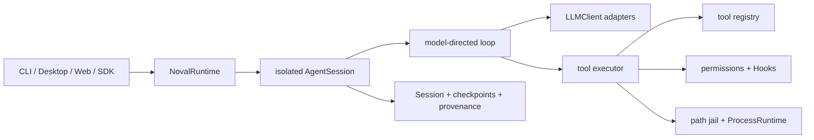

<p align="right"><strong>English</strong> | <a href="README.zh-CN.md">简体中文</a></p>

<p align="center">
  
</p>

[](https://github.com/kestiny18/Noval/actions/workflows/ci.yml)
[](pyproject.toml)
[](LICENSE)
[](https://github.com/kestiny18/Noval/releases/tag/v0.10.0)

<p align="center">
  <strong>Strong models need a thin harness.</strong><br>
  <sub>The model chooses the strategy. Noval makes action trustworthy.</sub>
</p>

## Why Noval

Models are rapidly improving at planning, coding, research, and revising their
own approach. The fragile part of an agent increasingly lives outside the
model: malformed tool arguments, uncontrolled commands, stale observations,
lost state, leaked credentials, and confident claims that were never verified.

Many agent frameworks answer this with more orchestration: a required planner,
executor, reviewer, workflow graph, and role hierarchy. Noval deliberately does
less.

> **The model owns the method. Noval owns reality, authority, continuity, and evidence.**

Planning and review remain available when useful, but the kernel does not force
them onto every task. Noval focuses on the durable boundary between a model and
the external world: how an action is authorized, executed, observed, recovered,
and checked.

Read the full [Noval Philosophy](PHILOSOPHY.md).

## What the harness guarantees

| Concern | Noval boundary |
|---|---|
| Provider coupling | Canonical messages behind replaceable `LLMClient` adapters |
| Tool definition | Typed Python function plus `@tool`; schema is generated |
| Tool execution | Central parsing, validation, permission, error, truncation, redaction, and trace pipeline |
| Local files | Read/write roots, symlink-safe path jail, read-before-write freshness checks |
| External processes | One `ProcessRuntime`, honest sandbox capability reporting, Linux Bubblewrap support |
| Authority | Session-scoped permission state; `FULL_ACCESS` never expands task scope or disables isolation |
| Recovery | Append-only canonical Sessions and rebuildable context checkpoints |
| Extensibility | On-demand Skills and stdio MCP tools without bypassing execution policy |
| Project validation | Pre/Post/Stop Hooks that can block action or reject a candidate ending |
| Embedding | JSON-safe multi-Session Application API independent of the CLI |

## Architecture



Noval keeps five public seams explicit:

1. **Provider** — SDK wire formats stay inside adapters.
2. **Registry** — tools are registered, never dispatched by loop `if/else`.
3. **Executor** — every tool call crosses the same policy and output boundary.
4. **State** — canonical Session history is truth; checkpoints and ledgers are
   derived state.
5. **Process** — every external process crosses `ProcessRuntime`; sandbox
   capability is reported rather than assumed.

See [DESIGN.md](DESIGN.md) and the [ADR index](docs/adr/README.md).

## Quick start

Noval requires Python 3.10 or newer.

```bash
git clone https://github.com/kestiny18/Noval.git
cd Noval
python -m venv .venv

# Windows PowerShell
.venv\Scripts\Activate.ps1

# macOS / Linux
# source .venv/bin/activate

python -m pip install -e .
```

Set a Provider API key. The default OpenAI-compatible adapter uses the key
configured by `api_key_env` (DeepSeek by default):

```powershell
$env:DEEPSEEK_API_KEY="your-key"
python -m noval --workdir C:\path\to\project
```

```bash
export DEEPSEEK_API_KEY="your-key"
python -m noval --workdir /path/to/project
```

Anthropic support is optional:

```bash
python -m pip install -e ".[anthropic]"
```

Then configure `~/.noval/settings.json`:

```json
{
  "provider": "anthropic",
  "model": "your-agent-model",
  "judge_model": "your-judge-model",
  "api_key_env": "ANTHROPIC_API_KEY",
  "anthropic_max_tokens": 8192
}
```

Do not place real credentials in `settings.example.json` or any tracked file.

## Embedding Noval

The CLI is a host adapter over the same Application API available to other
applications:

```python
from noval import (
    NovalRuntime,
    SessionOptions,
    SessionPersistence,
    TurnRequest,
)

with NovalRuntime.from_settings() as runtime:
    with runtime.create_session(SessionOptions(
        workdir="C:/work/project",
        persistence=SessionPersistence.PERSISTENT,
    )) as session:
        result = session.run_turn(TurnRequest("Inspect the project architecture."))
        print(result.to_dict())
```

One Runtime can own multiple isolated Sessions. A Session permits one active
turn; concurrent calls fail immediately with `session_busy` so the host remains
responsible for queueing policy.

See the complete offline example in
[`examples/headless-api`](examples/headless-api/README.md).

## Tools, Skills, MCP, and Hooks

Built-in tools cover confined file reading/search, safe write/edit state
machines, shell execution, Skills, and stdio MCP discovery. Tool risk is declared
as `READ`, `WRITE`, or `DANGEROUS`, with parameter-sensitive assessment where
appropriate.

Adding a domain tool remains intentionally small:

```python
from noval.tools import Risk, ToolError, tool

@tool(risk=Risk.READ, param_descriptions={"path": "File to inspect"})
def inspect_file(path: str) -> str:
    """Inspect a domain-specific file."""
    ...
```

Return raw domain content on success. Raise `ToolError` only when the tool can
provide a corrective domain message. The executor owns generic failures,
permission, timeout, truncation, redaction, and logging.

### Discovery filtering

At the workdir root, Noval combines `.gitignore` followed by `.llmignore` for
built-in file discovery. Both files use Git-style patterns; because
`.llmignore` is loaded last, it can add exclusions or re-include paths with
`!`. `list_directory`, `glob`, `grep`, and missing-file suggestions omit
matches, and recursive searches prune ignored directories before descending.

```gitignore
# .llmignore
node_modules/
dist/
build/
target/
*.map
```

This is a relevance and performance filter, not an access-control boundary.
An explicit `read_file` path remains readable, and external processes such as
`run_bash` do not inherit these rules. Use path confinement and the subprocess
sandbox when a path must be inaccessible.

Noval reuses established extension formats instead of inventing a private
ecosystem:

- Skills use `SKILL.md` packages and load full instructions/resources on demand.
- MCP uses common `mcpServers` configuration; v0.10 supports stdio servers.
- Project Hooks live in `<workdir>/.noval/hooks.json` and may validate before a
  tool, after a tool, or before accepting a candidate stop.

None of these extensions can override system policy, permission, path
confinement, sandboxing, redaction, or user scope.

## State and privacy

Persistent Sessions are stored under
`~/.noval/sessions/<workdir-hash>/` as canonical schema-v2 JSONL. Raw Session
history is append-only. Active context may use incremental checkpoints, but a
checkpoint never deletes or rewrites the source history.

Session content is currently plaintext and may include user-provided text,
files, and adapter-owned replay state. Set `"persist_sessions": false` for
ephemeral use. Runtime logs and usage events intentionally exclude conversation
content and tool argument values; common credential patterns are redacted at
tool and request-journal boundaries.

Noval never displays raw chain-of-thought. Provider-private thinking required
for protocol replay remains opaque to the core, compactor, judge, logs, and
other adapters.

## Validation, with an honest boundary

Project Stop Hooks can deterministically reject a candidate ending and return
diagnostics to the model. The independent semantic completion judge records a
structured verdict based on recent user inputs and the final visible reply.

The semantic judge does **not** prove that hidden tool operations or external
state are correct. A general goal/evidence contract is planned work. Noval
therefore distinguishes configured project validation from semantic completion
assessment instead of marketing both as the same guarantee.

## Development

```bash
python -m pip install -e ".[dev]"
python -m pytest -q
python -m evals.context.run
python -m evals.task.run
```

The regular test suite is offline and uses `MockClient`. Real-model Eval is
separate from normal CI. See [`evals/README.md`](evals/README.md).

## Current status

`v0.10.0` is the current stable release. Noval is still `0.x`: public contracts
may evolve before v1.0, and it is not a hosted product, a drag-and-drop workflow
builder, or an autonomous multi-agent team.

The next architectural work is evidence-aware completion, effect-aware
authority, behavior Eval, and v1.0 contract stabilization—not adding mandatory
agent roles to the core.

## Contributing and security

- Read [CONTRIBUTING.md](CONTRIBUTING.md) and [AGENTS.md](AGENTS.md).
- Significant architecture changes require an ADR.
- Report vulnerabilities through [SECURITY.md](SECURITY.md), not a public Issue.
- Release history is in [CHANGELOG.md](CHANGELOG.md).

Noval is licensed under the [MIT License](LICENSE).
