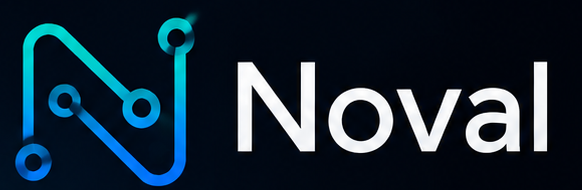
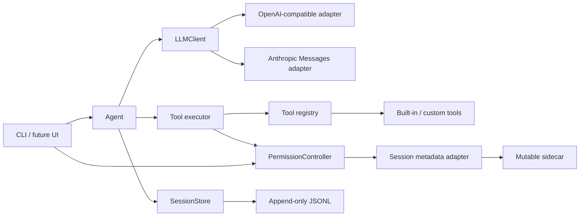

<p align="center">
  
</p>

[](https://github.com/kestiny18/Noval/actions/workflows/ci.yml)
[](pyproject.toml)
[](LICENSE)
[](https://github.com/kestiny18/Noval/releases/tag/v0.8.1)

<p align="center">
  <strong>模型负责思考。Noval 负责让它安全、可恢复、可验证地行动。</strong><br>
  <sub>Models think. Noval makes their actions trustworthy.</sub>
</p>

## 为什么还需要一个 Agent？

Agent 的“大脑”正在迅速变强，真正脆弱的部分却发生在模型之外：参数错了会不会崩、命令失控时谁来拦、输出太长时模型还能看见什么、进程中断后能否继续，以及模型说“完成了”时有没有人真正验证。

Noval 起源于一次最朴素的 tool-calling 实验：由人亲自扮演工具后端，把现实结果递回模型。那次实验暴露了一个常被忽略的事实——**模型只能通过工具返回值感知世界；执行层就是 Agent 的感官与身体。** Noval 做的，是把那个“人肉执行器”工程化。

它不和其它框架比赛谁有更多 Agent、工作流或集成。它专注于一条更窄、也更难替代的接缝：**模型与真实世界之间，怎样可靠地执行一次行动。**

| 常见原型的做法 | Noval 的选择 |
|---|---|
| 循环直接绑定某家模型 SDK | `LLMClient` 隔离 Provider，核心不依赖厂商 SDK |
| 每个工具各写一套 schema、异常、确认和日志 | `@tool` 只写领域逻辑，横切关注点统一进入 executor |
| 用提示词要求模型“小心一点” | 权限门、path-jail、子进程 runtime 与硬沙箱在模型之外执行 |
| 模型输出最终回复就算完成 | Hooks 可以否决结束，把诊断送回模型继续修复 |
| 崩溃后丢失现场，或用摘要覆盖原始历史 | append-only Session 是真相源，checkpoint 可回退、可重建 |

如果你正在构建自己的 Code Agent 或领域 Agent，希望保留完全可读、可替换、可测试的执行内核，而不是把产品交给一个巨型黑盒，Noval 就是为你准备的。它仍处于 `0.x`，不提供拖拽式工作流或“一键自治团队”；它提供的是一块可以长期演进的地基。

> **当前状态**：`v0.8.1` 是当前稳定版本，在 MCP、path-jail 与 Linux Bubblewrap 硬沙箱之上补齐了可否决、可反馈、可重复验证的项目级 Hooks 闭环。

## 核心设计

- **Provider 真中立**：Agent、Session、Context 与 Task 只处理 canonical block message；当前提供 OpenAI-compatible（含 DeepSeek）与 Anthropic Messages 两个 adapter。
- **工具可注册**：普通 Python 函数加 `@tool`，自动生成 JSON Schema；循环里没有工具名分发逻辑。
- **执行管道统一托底**：JSON 容错、参数校验、风险确认、异常、截断和 trace 集中在 `executor.py`。
- **工具状态显式化**：`Context` 携带 workdir、path-jail policy、read-tracker 和会话级 `PermissionController`，文件修改前必须先读并检查陈旧状态。
- **上下文按生命周期归位**：稳定规则、环境探测、项目记忆和当前时间分层注入，避免污染缓存前缀。
- **会话可恢复**：非 system 消息以 append-only JSONL 保存；恢复时按当前环境重建 system，并修复悬空 tool call。



架构约束见 [AGENTS.md](AGENTS.md)，完整决策推理见 [DESIGN.md](DESIGN.md)。

## 快速开始

需要 Python 3.10+。

```bash
git clone https://github.com/kestiny18/Noval.git
cd Noval
python -m venv .venv

# Windows PowerShell
.venv\Scripts\Activate.ps1

# macOS / Linux
# source .venv/bin/activate

pip install -e .

# 使用 Anthropic Provider 时安装可选依赖
# pip install -e ".[anthropic]"
```

设置 API key，二选一：

```bash
# Windows PowerShell
$env:DEEPSEEK_API_KEY="sk-你的key"

# macOS / Linux
# export DEEPSEEK_API_KEY="sk-你的key"
```

或者写入用户目录下的 `~/.noval/settings.json`：

```json
{
  "api_key": "sk-你的key"
}
```

该文件不在仓库内。不要把真实 key 写进 `settings.example.json` 或任何提交。

旧配置缺少 `provider` 时继续使用 `openai-compatible`。Anthropic 示例：

```json
{
  "provider": "anthropic",
  "model": "你的 Claude 模型名",
  "judge_model": "你的 Claude judge 模型名",
  "api_key_env": "ANTHROPIC_API_KEY",
  "anthropic_max_tokens": 8192
}
```

`anthropic_base_url` 留空时使用 Anthropic SDK 默认地址，也可以显式配置兼容网关。

启动：

```bash
python -m noval

# 指定 Agent 操作的项目目录
python -m noval --workdir C:/path/to/project

# 没有硬沙箱后端时拒绝启动外部进程
python -m noval --sandbox required

# 在硬沙箱中禁用网络
python -m noval --sandbox required --sandbox-network deny

# 恢复当前 workdir 的历史会话
python -m noval --resume

# 直接恢复指定会话
python -m noval --resume 20260623-153012-ab12
```

Windows 上如果 `python` 命中 Microsoft Store 占位程序，请把命令中的 `python` 换成 `py`。

## 内置工具

| 工具 | 风险 | 说明 |
|---|---|---|
| `read_file` | READ | 带行号读取，支持 offset/limit 流式翻页 |
| `list_directory` | READ | 列出目录内容 |
| `glob` | READ | 按文件名模式查找 |
| `grep` | READ | 正则搜索内容，支持 files/content/count 模式 |
| `list_skills` | READ | 列出当前 workdir 可用的 Skill 轻量索引 |
| `load_skill` | READ | 按需读取指定 Skill 的 `SKILL.md` 正文 |
| `read_skill_resource` | READ | 读取 Skill 目录内的附属资源文件 |
| `run_skill_script` | DANGEROUS | 在权限门后执行 Skill 目录内脚本 |
| `list_mcp_servers` | READ | 列出当前 workdir 可用的 MCP server 轻量索引 |
| `list_mcp_tools` | DANGEROUS | 按需启动指定 stdio MCP server 并列出其工具 |
| `call_mcp_tool` | DANGEROUS | 调用指定 MCP server 暴露的工具 |
| `write_file` | WRITE | 写文件；覆盖已有文件前必须完整读取 |
| `edit_file` | WRITE | 精确字符串替换，检查外部改动 |
| `run_bash` | DANGEROUS | 在 workdir 中执行命令；只读命令可动态降级 |

文件类工具默认受 path-jail 限制：`read_file` / `list_directory` / `glob` / `grep` 只能读取解析后位于允许 read roots 内的路径，`write_file` / `edit_file` 只能写入允许 write roots 内的路径。默认 read/write roots 都是当前 `workdir`；嵌入方可用 `ConfinementPolicy.expanded_read(...)` 显式增加只读根。`FULL_ACCESS` 只跳过确认门，不关闭 path-jail。

`run_bash`、Skill 脚本、shell 探测和 MCP stdio 启动统一经过 `ProcessRuntime`。一次性命令使用 `run()`，MCP 由 `prepare()` 包装 command/args/env/cwd 后继续交给官方 SDK 管理双向 stdio。Linux 上会探测 Bubblewrap 的实际可用性，通过后才启用硬沙箱：系统运行目录只读、工作区可写、未授权宿主路径不可见，并使用独立 PID namespace；`--sandbox-network deny` 还会隔离网络 namespace。默认 `--sandbox auto` 在缺少可用后端时明确降级为 `NoSandbox`，`--sandbox required` 则 fail-closed，`--sandbox off` 表示显式关闭。策略是本次启动状态，不写入 session sidecar，`FULL_ACCESS` 也不会改变它。

Ubuntu 24.04+ 若启用了 AppArmor 的 unprivileged user namespace 限制，需要安装并加载发行版提供的 `bwrap-userns-restrict` profile；Noval 的启动探测会把该问题作为 `NoSandbox` 原因明确报告。不要为了启用 Bubblewrap 而全局关闭 AppArmor 限制。

## Hooks

项目可以在 `<workdir>/.noval/hooks.json` 配置验证 Hooks。v0.8 第一版只读取项目级文件，不读取用户级 Hooks；事件按 `PreToolUse`、`PostToolUse`、`Stop` 分组，每组数组的声明顺序就是串行执行顺序。

```json
{
  "version": 1,
  "hooks": {
    "PostToolUse": [
      {
        "id": "lint-after-edit",
        "type": "command",
        "match": {
          "tools": ["write_file", "edit_file"],
          "status": ["success"]
        },
        "command": "python",
        "args": ["-m", "ruff", "check", "."],
        "timeout": 60
      }
    ],
    "Stop": [
      {
        "id": "tests-before-stop",
        "type": "command",
        "match": {
          "afterTools": ["write_file", "edit_file", "run_bash"]
        },
        "command": "python",
        "args": ["-m", "pytest", "-q"],
        "timeout": 300
      }
    ]
  }
}
```

CommandHook 不默认经过 shell，始终以显式 `command + args` 在 workdir 中通过 `ProcessRuntime` 执行。默认 `exit-code` 协议把退出码 0 视为 `allow`、非 0 视为 `deny` 并把截断、脱敏后的诊断交给模型；`protocol: "json"` 可显式返回 `allow`、`deny(reason)` 或 `context(text)`。Pre Hook 首个 deny 会阻止目标工具；Post Hook 全部运行并把失败附到对应 tool result；每个候选最终回复都会进入 Stop，`afterTools` 用于只匹配执行过指定工具的回合，任一 deny/context 都会隐藏该版最终回复并要求模型继续修复。相同 Stop 失败后若模型没有执行新的工具操作，框架会停止重复验证。

项目 Hook 命令按 DANGEROUS 操作确认，授权绑定 Hook id 与配置内容 hash；配置变化后旧授权不会沿用。配置只在用户回合边界刷新，Hook 命令本身不会递归触发 Hooks。Hooks 是验证扩展，不是权限、path-jail 或硬沙箱的替代品。

## Skills

Noval 的 Skill 机制不发明新格式，而是复用 Claude Code / Codex / Cursor 常见的目录包：每个 Skill 是一个目录，入口为 `SKILL.md`，可带 `references/`、`scripts/` 等附属文件。启动时会扫描：

- 用户级：`~/.claude/skills`、`~/.codex/skills`、`~/.cursor/skills`、`~/.noval/skills`
- 项目级：`<workdir>/.claude/skills`、`<workdir>/.codex/skills`、`<workdir>/.cursor/skills`、`<workdir>/.noval/skills`

Cursor 规则目录 `.cursor/rules` 不会被扫描。Noval 只把 Skill 的 id、name、description、source 作为轻量索引放进 system prompt；完整正文、资源和脚本由模型在需要时通过工具按需加载。会话运行中，Noval 会在用户回合边界用内存快照检测 Skill 增删改，并把变化作为本轮临时上下文提示模型；这个快照不写入 session、settings 或 checkpoint。Skill 脚本仍然走统一权限门、timeout、日志和截断，不会绕过框架约束。

## MCP

Noval 的 MCP 机制同样不发明新协议：它只作为 MCP host/client 使用通用 MCP server。第一版支持 stdio server，读取两类配置：

- 用户级：`~/.noval/mcp.json`
- 项目级：`<workdir>/.noval/mcp.json`

配置使用常见的 `mcpServers` 结构：

```json
{
  "mcpServers": {
    "demo": {
      "command": "python",
      "args": ["tools/mcp_demo_server.py"],
      "env": {
        "DEMO_TOKEN": "${DEMO_TOKEN}"
      }
    }
  }
}
```

Noval 启动时只把 server 的 id/name/source/transport/env key 作为轻量索引放进 system prompt，不展示 env 值，也不会自动启动外部进程。模型需要 MCP 能力时，先调用 `list_mcp_tools(server=...)` 发现该 server 的工具，再调用 `call_mcp_tool(...)` 执行。由于这两步都会启动外部 MCP 进程或调用外部能力，它们按 DANGEROUS 工具走统一权限门、timeout、日志和输出截断。MCP 子进程只继承官方 SDK 的安全基础环境，再叠加该 server 配置中显式声明的 env，不会收到完整父进程环境。若 MCP 返回的 text 内容本身是 JSON，Noval 会把它解析成结构化 `content`，避免模型面对“JSON 字符串里套 JSON”。

会话运行中新增、删除或修改 `mcp.json` 时，Noval 会在用户回合边界用内存快照检测变化，并把变化作为本轮临时上下文提示模型；这个快照不写入 session、settings 或 checkpoint。MCP 返回内容始终视为外部数据，不能覆盖 system、项目记忆、权限确认或用户指令。所有工具输出（包括 MCP 结果）进入模型和 session 前都会经过统一脱敏，覆盖常见 password / secret / token / privateKey / webhook 等形态。

加一个工具只需要实现它的领域逻辑：

```python
from noval.tools import Risk, ToolError, tool


@tool(risk=Risk.READ, param_descriptions={"path": "要读取的文件路径"})
def inspect_file(path: str) -> str:
    """检查指定文件。"""
    ...
```

成功时返回原始内容；只有工具自己知道的领域失败才抛 `ToolError`。通用异常、确认、截断和日志由执行层处理。

## 会话权限

新会话默认使用“请求批准”：READ / WRITE 直接执行，DANGEROUS 请求确认；“完全访问”则跳过工具确认门。权限属于会话而非全局设置，模式和“本会话总是允许”的工具都会随 `--resume` 直接恢复。

```text
/permissions                         # 查看当前状态
/permissions ask                    # 请求批准
/permissions full-access             # 完全访问
/permissions allow run_bash          # 本会话始终允许某工具
/permissions revoke run_bash         # 撤销某工具授权
/permissions reset                   # 回到请求批准并清空工具授权
```

在请求批准模式下，确认提示中的 `[a]` 仍可授权当前工具。本会话授权 `run_bash` 意味着其后任意命令都不再询问，CLI 会明确提示这一范围。完全访问只跳过确认，不改变 workdir 边界、超时、日志脱敏等框架约束。

## 思考模式

Noval 不展示原始思考过程。DeepSeek 工具轮所需的 `reasoning_content`，以及 Anthropic thinking / redacted-thinking blocks，只作为所属 adapter 的 opaque replay state 保存和回传；核心、上下文压缩器、completion judge、运行日志和其它 Provider 都不会读取它。

每轮回答后会显示 reasoning token、模型耗时与工具调用次数。输入 `/reasoning` 可查看当前模式和上一次请求指标；这些结构化指标也不会包含思考正文。

## Token 用量

Noval 默认记录 Provider 返回的实际 token 用量，不在本地估算。输入 `/usage` 可查看当天所有 Noval 进程、项目和会话的总请求数、输入、输出、缓存命中/未命中、reasoning 与总 token；当天使用多个模型时会额外按模型展开。

用量事件写入 `~/.noval/usage/YYYY-MM-DD/noval-<session>-<pid>.jsonl`。每个进程独立追加，查询时再汇总，避免多个会话争用同一个计数文件；事件只包含时间、模型和 token 数，不保存 workdir、对话或工具内容。可通过 `persist_usage` 和 `usage_dir` 调整或关闭。

## 会话持久化

会话默认存放在 `~/.noval/sessions/<workdir-hash>/`：

```text
project.json
20260623-153012-ab12.jsonl
20260623-153012-ab12.meta.json
```

- JSONL schema v2 保存 canonical user / assistant / tool block messages；system prompt、环境和项目记忆在恢复时重建。
- 标题默认从第一条用户消息派生；自定义标题与会话权限写入独立 sidecar。
- 坏行和进程崩溃留下的半截尾行会被跳过，不废掉整个会话。
- 内容目前是明文，可能包含用户粘贴的密钥、文件内容和 adapter-owned replay state。可用 `"persist_sessions": false` 关闭。

v0.9 不读取或迁移旧 schema v1 Session：会话列表会标记为不兼容，尝试恢复时返回明确错误，原文件保持不变。旧 checkpoint 同样不会复用。

这部分已通过自动化测试与真实任务验证，包括多 workdir、中文路径、大历史、任务中断和进程强杀恢复。同一 session 不支持多进程并发写入。

### 上下文压缩

原始会话会持续完整追加，但发送给模型的 active context 默认使用 `256000` token 工作预算。估算达到 70% 时，Noval 会把较早的完整对话回合压缩成结构化摘要，保留最近原始回合；达到 85% 且无法安全压缩时停止请求，避免撞上 Provider 上限。

压缩 checkpoint 存放在同一项目会话目录的 `context/<session>.jsonl`。恢复时直接加载最新有效 checkpoint 与它之后的原始消息，不重新压缩已覆盖历史；后续 checkpoint 只合并上一个摘要与新增尾部。原始 `<session>.jsonl` 永不删除或改写，checkpoint 损坏时可回退到上一个或完整历史。

可通过 `context_budget_tokens` 调整 active context 预算，例如 DeepSeek V4-Pro 场景可按实际质量、延迟和成本逐步放宽，最高能力不等于推荐日常工作容量。

## 运行日志

运行日志默认写入 `~/.noval/logs/YYYY-MM-DD/noval-<session>-<pid>.log`，保留 14 天。不同进程各写一个文件，避免多会话互相争用；CLI 仍只显示必要的 INFO/WARNING，`httpx` 请求流水不再刷屏。

运行日志只记录工具名、参数名、耗时、错误和截断状态，不保存用户对话、工具参数值或工具输出；常见 API key、token、密码形态还会经过二次脱敏。它与上面的会话 JSONL 不同：会话为恢复上下文仍会保存明文正文。

可通过 `persist_logs`、`logs_dir` 和 `log_retention_days` 调整或关闭运行日志。

## 版本里程碑

| 版本 | 定位 | 对应引用 |
|---|---|---|
| `v0.1.0` | 最小可运行内核：单工具、Provider/Registry/Executor 三条接缝 | `v0.1.0` |
| `v0.2.0` | 多工具收敛版：文件状态机、风险分级、环境与项目记忆、真实任务加固 | `v0.2.0` |
| `v0.3.0` | 会话持久化与恢复：多项目隔离、append-only 日志、中断自愈 | `v0.3.0` |
| `v0.4.0` | 运行治理与可观测性：会话权限、脱敏日志、thinking 协议、Token 统计 | `v0.4.0` |
| `v0.5.0` | 评测与可扩展能力：context Eval、任务完成 judge、增量压缩、Skills 运行机制 | `v0.5.0` |
| `v0.7.0` | 行动边界与进程隔离：MCP client、path-jail、统一子进程运行时、Linux Bubblewrap | `v0.7.0` |
| `v0.8.0` | Hooks 与验证闭环：Pre 阻断、Post 诊断回流、Stop 修复再验证、配置指纹授权 | `v0.8.0` |
| `v0.8.1` | Hooks 发布加固：所有候选结束均进入 Stop，严格校验 timeout 有限值 | `v0.8.1` |
| `v0.9.0` | Provider 真中立：canonical messages、Session v2、OpenAI-compatible 与 Anthropic adapters | 开发中 |

详细变化见 [CHANGELOG.md](CHANGELOG.md)。

## 开发与测试

```bash
pip install -e ".[dev]"
python -m pytest -q
```

CI 覆盖 Python 3.10-3.13，并在 Windows 上额外验证当前主版本；专用 Linux job 会安装 Bubblewrap 并执行真实逃逸测试。

上下文 checkpoint 的确定性 Eval 资产可零成本校验：

```bash
python -m evals.context.run
```

真实模型生成、离线重放和报告命令见 [`evals/context/README.md`](evals/context/README.md)。真实模型 Eval 不进入普通 CI。

## 当前状态与方向

Noval 当前处于 `0.x` 阶段，核心能力包括工具注册表、统一 executor、会话持久化、上下文 checkpoint、Skills/MCP MVP、任务完成 judge、项目级 Hooks、运行日志和 Token 用量统计。它已经不是一次性原型，但公共接口仍会继续演进。

接下来的重点不是堆更多工具，而是验证 Provider-neutral transcript 与恢复行为、继续扩展其它平台硬沙箱，并推进可嵌入稳定内核。详细路线、版本门槛和设计权衡见 [DESIGN.md](DESIGN.md#能力演进路线)。

## 参与项目

- 贡献前请读 [CONTRIBUTING.md](CONTRIBUTING.md) 和 [AGENTS.md](AGENTS.md)。
- 原则性设计变更需要同步记录到 [DESIGN.md](DESIGN.md)。
- 安全问题请不要附带真实 API key、会话日志或敏感文件内容。

Noval 使用 [MIT License](LICENSE)。
