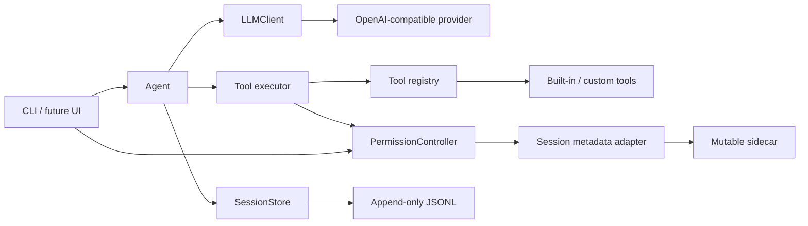

# Noval

[](https://github.com/kestiny18/Noval/actions/workflows/ci.yml)
[](pyproject.toml)
[](LICENSE)
[](https://github.com/kestiny18/Noval/releases/tag/v0.4.0)

一个与具体场景解耦的 Python Agent 小核心：负责模型调用、工具注册与执行、安全确认、项目上下文和会话恢复，不绑定 coding、搜索或任何单一应用。

Noval 关注的不是“再包一层聊天接口”，而是 Agent 真正容易失控的地基：模型怎样可靠地感知工具结果、怎样从错误中自我纠正、怎样限制危险操作，以及怎样在中断后恢复合法的对话历史。

> **当前状态**：`v0.4.0` 是当前稳定里程碑，在会话持久化基础上补齐了会话权限、脱敏运行日志、DeepSeek thinking 协议和 Token 用量统计。

## 核心设计

- **Provider 可替换**：Agent 循环只依赖 `LLMClient`，当前实现支持 DeepSeek / OpenAI 兼容接口。
- **工具可注册**：普通 Python 函数加 `@tool`，自动生成 JSON Schema；循环里没有工具名分发逻辑。
- **执行管道统一托底**：JSON 容错、参数校验、风险确认、异常、截断和 trace 集中在 `executor.py`。
- **工具状态显式化**：`Context` 携带 workdir、read-tracker 和会话级 `PermissionController`，文件修改前必须先读并检查陈旧状态。
- **上下文按生命周期归位**：稳定规则、环境探测、项目记忆和当前时间分层注入，避免污染缓存前缀。
- **会话可恢复**：非 system 消息以 append-only JSONL 保存；恢复时按当前环境重建 system，并修复悬空 tool call。



架构约束见 [AGENTS.md](AGENTS.md)，完整决策推理见 [DESIGN.md](DESIGN.md)。

## 快速开始

需要 Python 3.10+。

```bash
git clone https://github.com/kestiny18/Noval.git
cd Noval
python -m venv .venv

# Windows PowerShell
.venv\Scripts\Activate.ps1

# macOS / Linux
# source .venv/bin/activate

pip install -e .
```

设置 API key，二选一：

```bash
# Windows PowerShell
$env:DEEPSEEK_API_KEY="sk-你的key"

# macOS / Linux
# export DEEPSEEK_API_KEY="sk-你的key"
```

或者写入用户目录下的 `~/.noval/settings.json`：

```json
{
  "api_key": "sk-你的key"
}
```

该文件不在仓库内。不要把真实 key 写进 `settings.example.json` 或任何提交。

启动：

```bash
python -m noval

# 指定 Agent 操作的项目目录
python -m noval --workdir C:/path/to/project

# 恢复当前 workdir 的历史会话
python -m noval --resume

# 直接恢复指定会话
python -m noval --resume 20260623-153012-ab12
```

Windows 上如果 `python` 命中 Microsoft Store 占位程序，请把命令中的 `python` 换成 `py`。

## 内置工具

| 工具 | 风险 | 说明 |
|---|---|---|
| `read_file` | READ | 带行号读取，支持 offset/limit 流式翻页 |
| `list_directory` | READ | 列出目录内容 |
| `glob` | READ | 按文件名模式查找 |
| `grep` | READ | 正则搜索内容，支持 files/content/count 模式 |
| `write_file` | WRITE | 写文件；覆盖已有文件前必须完整读取 |
| `edit_file` | WRITE | 精确字符串替换，检查外部改动 |
| `run_bash` | DANGEROUS | 在 workdir 中执行命令；只读命令可动态降级 |

加一个工具只需要实现它的领域逻辑：

```python
from noval.tools import Risk, ToolError, tool


@tool(risk=Risk.READ, param_descriptions={"path": "要读取的文件路径"})
def inspect_file(path: str) -> str:
    """检查指定文件。"""
    ...
```

成功时返回原始内容；只有工具自己知道的领域失败才抛 `ToolError`。通用异常、确认、截断和日志由执行层处理。

## 会话权限

新会话默认使用“请求批准”：READ / WRITE 直接执行，DANGEROUS 请求确认；“完全访问”则跳过工具确认门。权限属于会话而非全局设置，模式和“本会话总是允许”的工具都会随 `--resume` 直接恢复。

```text
/permissions                         # 查看当前状态
/permissions ask                    # 请求批准
/permissions full-access             # 完全访问
/permissions allow run_bash          # 本会话始终允许某工具
/permissions revoke run_bash         # 撤销某工具授权
/permissions reset                   # 回到请求批准并清空工具授权
```

在请求批准模式下，确认提示中的 `[a]` 仍可授权当前工具。本会话授权 `run_bash` 意味着其后任意命令都不再询问，CLI 会明确提示这一范围。完全访问只跳过确认，不改变 workdir 边界、超时、日志脱敏等框架约束。

## 思考模式

DeepSeek 当前默认开启思考模式。Noval 不展示原始思考过程；工具调用轮所需的 `reasoning_content` 只作为 Provider 协议状态回传并随会话保存，普通最终回复不保存该字段。

每轮回答后会显示 reasoning token、模型耗时与工具调用次数。输入 `/reasoning` 可查看当前模式和上一次请求指标；这些结构化指标也不会包含思考正文。

## Token 用量

Noval 默认记录 Provider 返回的实际 token 用量，不在本地估算。输入 `/usage` 可查看当天所有 Noval 进程、项目和会话的总请求数、输入、输出、缓存命中/未命中、reasoning 与总 token；当天使用多个模型时会额外按模型展开。

用量事件写入 `~/.noval/usage/YYYY-MM-DD/noval-<session>-<pid>.jsonl`。每个进程独立追加，查询时再汇总，避免多个会话争用同一个计数文件；事件只包含时间、模型和 token 数，不保存 workdir、对话或工具内容。可通过 `persist_usage` 和 `usage_dir` 调整或关闭。

## 会话持久化

会话默认存放在 `~/.noval/sessions/<workdir-hash>/`：

```text
project.json
20260623-153012-ab12.jsonl
20260623-153012-ab12.meta.json
```

- JSONL 保存 user / assistant / tool 消息；system prompt、环境和项目记忆在恢复时重建。
- 标题默认从第一条用户消息派生；自定义标题与会话权限写入独立 sidecar。
- 坏行和进程崩溃留下的半截尾行会被跳过，不废掉整个会话。
- 内容目前是明文，可能包含用户粘贴的密钥、文件内容，以及工具调用轮为协议续传所需的 `reasoning_content`。可用 `"persist_sessions": false` 关闭。

这部分已通过自动化测试与真实任务验证，包括多 workdir、中文路径、大历史、任务中断和进程强杀恢复。同一 session 不支持多进程并发写入。

### 上下文压缩

原始会话会持续完整追加，但发送给模型的 active context 默认使用 `256000` token 工作预算。估算达到 70% 时，Noval 会把较早的完整对话回合压缩成结构化摘要，保留最近原始回合；达到 85% 且无法安全压缩时停止请求，避免撞上 Provider 上限。

压缩 checkpoint 存放在同一项目会话目录的 `context/<session>.jsonl`。恢复时直接加载最新有效 checkpoint 与它之后的原始消息，不重新压缩已覆盖历史；后续 checkpoint 只合并上一个摘要与新增尾部。原始 `<session>.jsonl` 永不删除或改写，checkpoint 损坏时可回退到上一个或完整历史。

可通过 `context_budget_tokens` 调整 active context 预算，例如 DeepSeek V4-Pro 场景可按实际质量、延迟和成本逐步放宽，最高能力不等于推荐日常工作容量。

## 运行日志

运行日志默认写入 `~/.noval/logs/YYYY-MM-DD/noval-<session>-<pid>.log`，保留 14 天。不同进程各写一个文件，避免多会话互相争用；CLI 仍只显示必要的 INFO/WARNING，`httpx` 请求流水不再刷屏。

运行日志只记录工具名、参数名、耗时、错误和截断状态，不保存用户对话、工具参数值或工具输出；常见 API key、token、密码形态还会经过二次脱敏。它与上面的会话 JSONL 不同：会话为恢复上下文仍会保存明文正文。

可通过 `persist_logs`、`logs_dir` 和 `log_retention_days` 调整或关闭运行日志。

## 版本里程碑

| 版本 | 定位 | 对应引用 |
|---|---|---|
| `v0.1.0` | 最小可运行内核：单工具、Provider/Registry/Executor 三条接缝 | `v0.1.0` |
| `v0.2.0` | 多工具收敛版：文件状态机、风险分级、环境与项目记忆、真实任务加固 | `v0.2.0` |
| `v0.3.0` | 会话持久化与恢复：多项目隔离、append-only 日志、中断自愈 | `v0.3.0` |
| `v0.4.0` | 运行治理与可观测性：会话权限、脱敏日志、thinking 协议、Token 统计 | `v0.4.0` |

详细变化见 [CHANGELOG.md](CHANGELOG.md)。

## 开发与测试

```bash
pip install -e ".[dev]"
python -m pytest -q
```

CI 覆盖 Python 3.10-3.13，并在 Windows 上额外验证当前主版本。

上下文 checkpoint 的确定性 Eval 资产可零成本校验：

```bash
python -m evals.context.run
```

真实模型生成、离线重放和报告命令见 [`evals/context/README.md`](evals/context/README.md)。真实模型 Eval 不进入普通 CI。

## 路线图

1. ✅ 评测脊柱 MVP：结构、语义、冷恢复、对话内继续、受控行动与模型 Judge；真实切片、阈值回放和确定性安全后处理持续增强。
2. ⏳ 任务状态与完成验证：显式任务账本、完成证据、恢复后去重执行。
3. ⏳ Skill：按需加载、版本化、可测试的程序性知识。
4. ⏳ 长任务与记忆：暂停/恢复、取消、唤醒和有来源的分层记忆。
5. ⏳ 模型路由：按能力、成本、延迟和风险选择 Provider/模型。
6. ⏳ 多 Agent：共享任务状态、预算、结果合并和独立复核。

详细阶段边界与出口标准见 [DESIGN.md](DESIGN.md#能力演进路线)。

## 参与项目

- 贡献前请读 [CONTRIBUTING.md](CONTRIBUTING.md) 和 [AGENTS.md](AGENTS.md)。
- 原则性设计变更需要同步记录到 [DESIGN.md](DESIGN.md)。
- 安全问题请不要附带真实 API key、会话日志或敏感文件内容。

Noval 使用 [MIT License](LICENSE)。
