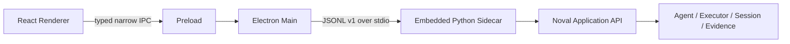

# Noval Desktop Host Design

## Goal and boundaries

Noval Desktop is the first-party host for the existing Python execution kernel.
Electron is a product shell, not a second runtime. The Renderer renders safe
state; Main owns authority-bearing desktop operations; the embedded Python
sidecar alone owns `NovalRuntime` and `AgentSession` objects.

Imports are directional. Nothing under `noval/` imports `desktop/`. The
sidecar may import public values from `noval`, but not `Agent`, executor
internals, Provider SDK objects, or Session store implementations.

## Process and protocol model

Main launches exactly one sidecar with piped stdin/stdout and a minimal explicit
environment. Stdout is protocol-only; diagnostics go to stderr. Every line is
one UTF-8 JSON object with `protocol_version`, `kind`, and an identifier.

- Request: `request_id`, `method`, `params`.
- Response: `request_id`, `ok`, and either `result` or a safe `error`.
- Event: `event_id`, `event`, and `payload`.

The first message is `hello`, containing protocol, Desktop, Core, Python, and
platform versions. A protocol-major mismatch fails closed. Unknown fields are
ignored within a major version; unknown commands return `method_not_found`.
Lines have a fixed maximum size and malformed input produces a safe protocol
error without printing the input.

Turn execution runs on a sidecar worker so the command reader remains
responsive to cancellation and permission decisions. Permission requests have
correlation ids and bounded waits. Main may render the request, but it never
makes the decision itself; the selected answer is returned to the public
Session permission handler.

If the sidecar exits, Main marks live activity interrupted, preserves Renderer
state only as a cache, restarts with bounded backoff, and reconstructs durable
state from Session listing and transcript. Partial streamed text is discarded
unless it exists in the canonical transcript.

## Product state and user flows

The app opens without a Runtime Session. The user must select an existing
directory. One window has one active workspace; recent workspaces are Desktop
preferences. Sessions remain permanently bound to their original normalized
workdir.

The main layout follows a restrained task-centered desktop pattern: workspace
and Session navigation on the left, the active conversation in the center, and
contextual details in inline cards or a secondary panel. The composer always
shows Provider/model, current permission mode, send/stop state, and relevant
errors. Tool activity exposes safe names, risks, targets, outcomes, and
durations without raw logs. Completion evidence distinguishes an assistant
reply from verified completion.

New Sessions start in `ASK`. Existing Sessions restore their persisted mode and
tool grants exactly. `FULL_ACCESS` is visually persistent and Session-scoped.
Enabling it requires an explicit confirmation explaining that confinement,
sandboxing, Hooks, redaction, and scope still apply.

Provider profiles support OpenAI-compatible endpoints and Anthropic. Renderer
receives only masked credential metadata. Main encrypts saved secrets with
Electron `safeStorage`; session-only secrets remain in memory. The selected
credential is passed only to the sidecar process that needs it and never enters
protocol payloads, logs, Session files, or diagnostic archives.

## Security and privacy

- `contextIsolation` and Renderer sandbox are enabled; Node integration is off.
- Preload exposes named methods, never raw `ipcRenderer`.
- Main validates every IPC argument and every sidecar envelope.
- Navigation, popups, permission requests, and unexpected external URLs fail
  closed.
- Content Security Policy permits only packaged resources.
- Protocol output, local logs, and diagnostics exclude prompts, message bodies,
  tool argument values, tool output, credentials, and opaque reasoning.
- There is no remote telemetry in the preview.

## Test and Eval boundary

Production Core has no desktop or Eval mode. Existing `tests/` and `evals/`
continue to validate Python behavior independently. Desktop adds:

- Python protocol unit and integration tests;
- TypeScript schema and compatibility tests;
- Main/preload IPC authorization tests;
- Renderer state and accessibility tests;
- packaged sidecar smoke tests;
- Playwright Electron flows for workspace selection, Session recovery,
  permission decisions, `FULL_ACCESS`, cancellation, and sidecar restart.

The preview is complete only when Core tests and Evals remain green, Desktop
tests pass, the packaged app starts without system Python, and the unsigned
installer installs and uninstalls on Windows. Merge to `main` waits for explicit
human installation acceptance.

